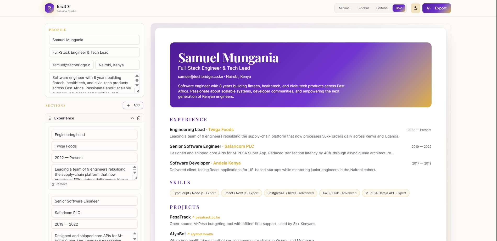

# KaziCV — Professional Resume Builder

> *Kazi* (Swahili) — work, occupation, craft.

KaziCV is a fast, polished resume builder designed for Kenya's professionals. Edit your details in the left panel, watch the live preview update in real time, and export clean HTML when you're ready.

Default resume features **Samuel Mungania** — a Nairobi-based Engineering Lead with experience across Twiga Foods, Safaricom, and Andela Kenya.

---

## Preview

### 🌙 Dark Mode — Sidebar Template
> Two-column layout with Skills & Education in the left aside, Experience and Projects on the right. Deep black background with royal purple accents and gold highlights.



### ☀️ Light Mode — Bold Template
> Single-column layout with a full-bleed purple-to-gold gradient header. Ivory canvas background with clean section spacing.


> **Note:** The theme toggle automatically switches between these two default templates. You can manually pick any of the 4 templates at any time.

---

## Features

- **Live preview** — every edit reflects instantly, no save button needed
- **Drag-and-drop sections** — reorder Experience, Skills, Education, and Projects with a grab handle
- **4 templates** — Minimal, Sidebar, Editorial, and Bold; switch with one click
- **Theme-linked defaults** — Dark mode opens with Sidebar; Light mode opens with Bold
- **Dark / Light mode** — persisted across sessions via `localStorage`
- **Export** — copies clean Tailwind HTML or raw JSON to your clipboard
- **Kenyan-first defaults** — sample data features Nairobi engineers, real Kenyan companies, Swahili-named projects, and `.co.ke` domains
- **Custom favicon** — a purple & gold "K" lettermark matching the brand

---

## Tech Stack

| Layer | Library |
|---|---|
| Build tool | Vite 7 |
| UI | React 19 |
| Drag & Drop | @dnd-kit/core + @dnd-kit/sortable |
| Animations | Framer Motion |
| Styling | Tailwind CSS v4 |
| UI primitives | Radix UI + shadcn/ui |
| Icons | Lucide React |
| Code highlight | Prism.js |

---

## Getting Started

### Prerequisites

- Node.js 20+
- `npm` (or `yarn` / `pnpm`)

### Install & Run

```bash
# 1. Enter the project folder
cd kazicv

# 2. Install dependencies
npm install

# 3. Start the dev server
npm run dev
```

Open [http://localhost:5173](http://localhost:5173) in your browser.

### Build for Production

```bash
npm run build
npm run preview
```

---

## Project Structure

```
kazicv/
├── docs/
│   ├── dark-preview.png            # Dark mode screenshot (Sidebar template)
│   └── light-preview.png           # Light mode screenshot (Bold template)
├── public/
│   └── favicon.svg                 # Purple & gold "K" lettermark favicon
├── src/
│   ├── components/
│   │   ├── resume/
│   │   │   ├── ExportModal.tsx     # HTML / JSON export dialog
│   │   │   ├── ResumePreview.tsx   # Live preview with template rendering
│   │   │   └── SortableSection.tsx # Drag-and-drop section editor
│   │   └── ui/                     # Radix UI / shadcn primitives
│   ├── hooks/
│   │   └── use-theme.ts            # Dark/light mode toggle + persistence
│   ├── lib/
│   │   ├── resume-types.ts         # Types, Kenyan default data, uid helper
│   │   └── utils.ts                # cn() class merging utility
│   ├── App.tsx                     # Main builder page + theme/template sync
│   ├── main.tsx                    # React root entry point
│   └── style.css                   # Tailwind config & design tokens
├── index.html
├── package.json
├── tsconfig.json
├── vite.config.js
└── README.md
```

---

## Templates

| ID | Description | Default for |
|---|---|---|
| `minimal` | Single-column, clean serif heading, gold divider | — |
| `sidebar` | Two-column — Skills & Education pinned to the left | 🌙 Dark mode |
| `editorial` | Centred Playfair Display heading, magazine feel | — |
| `bold` | Full-bleed gradient header, high-contrast labels | ☀️ Light mode |

---

## Customising the Default Resume

Edit `src/lib/resume-types.ts` — the `defaultResume()` function returns the initial state loaded on first visit. Swap the name, employer history, and skills to your own.

---

## Adding Preview Screenshots

To include the screenshots in the README, save them to the `docs/` folder:

```
kazicv/docs/dark-preview.png   ← dark mode screenshot
kazicv/docs/light-preview.png  ← light mode screenshot
```

The README already references these paths — just drop the images in.

---

## Favicon

The favicon (`public/favicon.svg`) is a hand-crafted SVG: a purple-to-violet gradient background with a bold **K** lettermark and a gold accent bar — matching the KaziCV purple/gold design system.

---

## Developer

Developed by **Victor Meme**

---

## License

MIT — free to use, modify, and distribute.

---

*Built with ❤️ for Kenya's tech community.*
